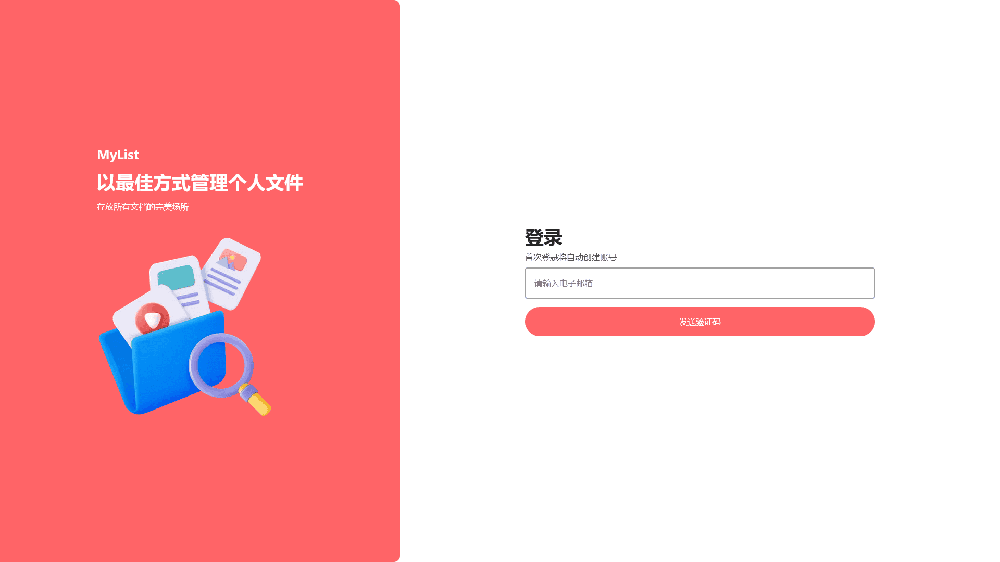
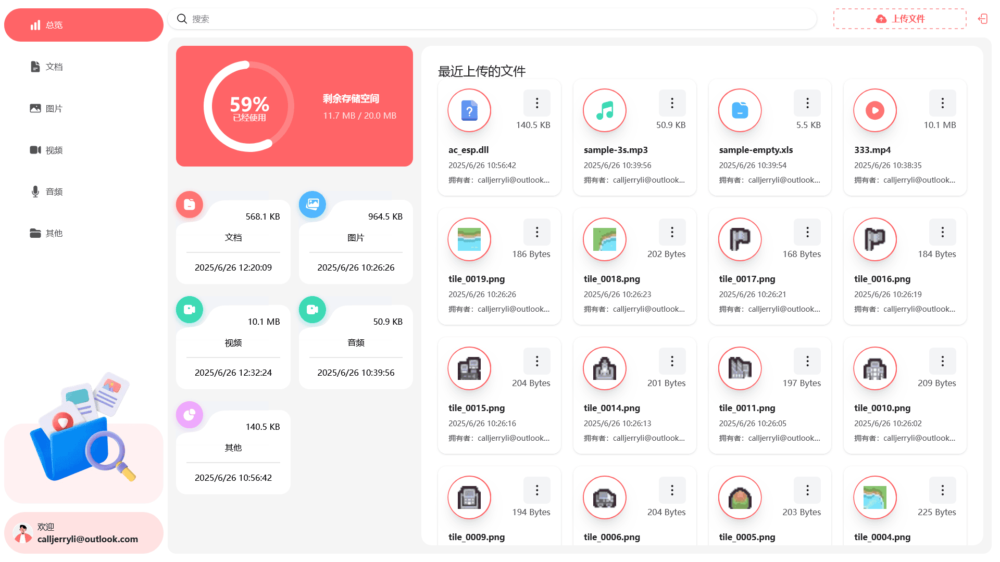

# MyList - WIP

_MyList_ 是一个开源、免费、自托管的文件存储和共享平台，让用户可以轻松上传、组织和共享文件。

## 在线试用

https://mylist-tawny.vercel.app

**在线试用仅供演示，不保证数据的安全性，所以请勿上传敏感文件到试用平台中，推荐每个用户部署自己的实例**

## 功能

- 用户认证：使用 Appwrite 的认证系统实现注册、登录和登出功能
- 文件上传：轻松上传多种文件类型，包括文档、图片、视频、音频和其他，保存所有重要数据
- 文件管理：用户可以浏览已经上传到平台中的文件，在新标签页查看、重命名或删除文件
- 数据仪表：通过动态仪表盘一目了然地获取总体情况，展示总存储量和已用存储量、最近上传内容以及按类型分组的文件摘要
- 全局搜索：用户可以通过强大的全局搜索功能快速在平台内查找文件和共享内容
- 排序选项：通过按日期、名称或大小排序，高效组织文件，使文件管理变得轻松
- 还有更多：使用最新的 React 19、Next.js 15 和 Tailwind CSS 4 驱动，Next.js 全栈代码架构确保了项目的易部署性和可重用性

## 技术栈

- React
- Next.js
- Tailwind CSS
- TypeScript
- Appwrite

## 快速开始

按照以下步骤在本地机器上设置项目：

### 克隆代码仓库

```bash
git clone https://github.com/jerryshell/mylist.git
cd mylist
```

### 安装项目依赖

```bash
npm install
```

### 设置环境变量

在项目根目录下创建一个 `.env.local` 文件，并添加以下内容：

```env
NEXT_APPWRITE_ENDPOINT=""
NEXT_APPWRITE_PROJECT_ID=""
NEXT_APPWRITE_DATABASE_ID=""
NEXT_APPWRITE_COLLECTION_USER_FILE_ID=""
NEXT_APPWRITE_BUCKET_ID=""
NEXT_APPWRITE_API_KEY=""
```

将值替换为实际的 Appwrite 凭证，可以通过在 [Appwrite](https://appwrite.io) 注册并创建新项目来获取这些凭证。

具体的 Appwrite 配置请参考项目的 [appwrite.json](appwrite.json) 文件。

_Appwrite 是一个开源的后端基础设施，可以使用自己的服务器进行自托管所以不用担心 [供应商锁定](https://www.cloudflare-cn.com/learning/cloud/what-is-vendor-lock-in/) 的问题。_

### 运行项目

```bash
npm run dev
```

在浏览器中打开 http://localhost:3000 查看项目。

## 项目截图




## 开源协议

[GNU Affero General Public License v3.0](LICENSE)
